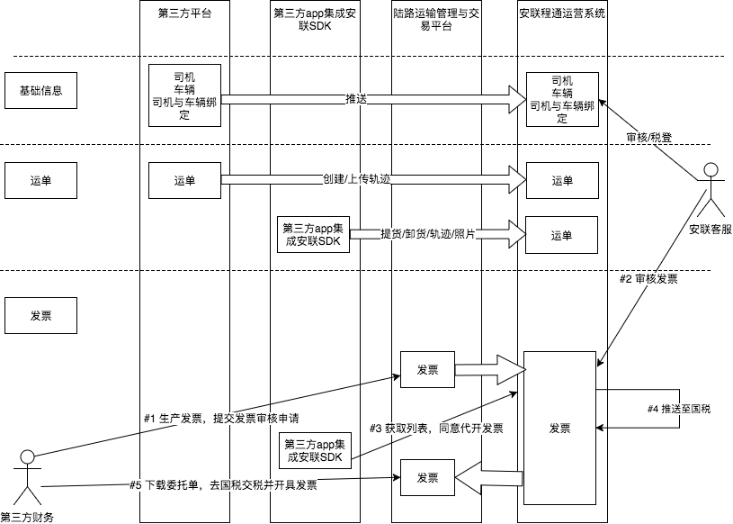

安联Openapi集成文档
# 1 简介

安联程通平台的服务集成包括：陆路运输管理与交易平台(以下简称陆交平台)集成，和企业自有Android APP的集成。陆交平台集成支持用户应用与陆交平台交换业务数据，包括公路运单、以及执行运单车辆的卫星轨迹。企业自有Android APP的集成是通过安联程通提供的SDK，将司机运输过程业务数据同步传输到陆交平台。
注意：平台集成支持测试环境和生产环境，只有测试完成后才可以切换成生产环境。

| 测试地址 | 生产地址 |
| ------------- |-------------| 
| x-staging.alct56.com | x.alct56.com |
| oapi-staging.alct56.com | oapi.alct56.com |

## 集成概述

集成分为2部分，web api集成和sdk集成
* web api集成需要第三方平台调用安联平台提供的api，完成基础信息和运单信息的集成
* sdk集成主要是运单的生命周期与发票集成，运单生命周期集成包括提货/卸货/轨迹/照片，发票集成包括获取待同意列表和同意代开发票

发票生产和提交申请，需要第三方工作人员登录陆路运输管理与交易平台进行操作

业务操作注意点:
* 在测试过程中，在完成司机卡车注册后，需要安联客服进行税登，否则不能生产发票
* 在申请发票后，需要安联客服审核，通过后司机才可以看到发票申请
